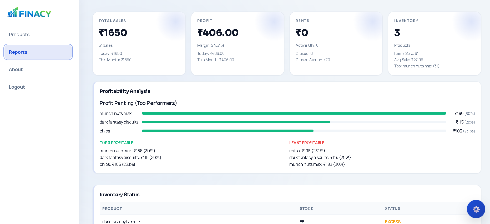

# FINACY

Offline-first business management for small shops and micro-entrepreneurs.

Problem

Small businesses often need simple, dependable tools that work without reliable internet. FINACY is designed to run fully on-device so shop owners can manage inventory, sales, and rentals offline without cloud dependency.

Features

- **Inventory:** Add/edit products, SKUs, categories, and stock counts.
- **Sales:** Record transactions, print or export receipts, and view daily summaries.
- **Rentals:** Check items out/in, track due dates and rental fees.
- **Real-time low-stock alerts:** In-app alerts when an item falls below a configured threshold.

Privacy note

All user data is stored 100% on-device by default (IndexedDB). There is no cloud synchronization unless explicitly enabled by the user. This minimizes the risk of cloud data leakage and keeps sensitive business information under the owner's control.

Tech stack + IndexedDB optimization challenge

- **Tech stack:** Static HTML, CSS, JavaScript (vanilla), optional small libraries, and Firebase Hosting for serving the site.
- **Storage:** Uses IndexedDB for client-side persistence so the app works offline.

IndexedDB is powerful but requires careful schema and query design for good performance at scale. Optimization approaches used or recommended:

- Design object stores and `keyPath`s for common access patterns (e.g., `sku`, `category`, `updatedAt`).
- Create indexes for queries you run frequently (low-stock queries, lookups by SKU).
- Use `IDBKeyRange` and cursor-based iteration for efficient range queries and pagination.
- Batch writes in transactions and avoid long-running transactions that block the event loop.
- Cache hot indexes in memory when needed and compact or archive old transactional logs to reduce storage churn.
- Consider using a small wrapper like `idb` to simplify async IndexedDB code and reduce bugs.

Screenshots

